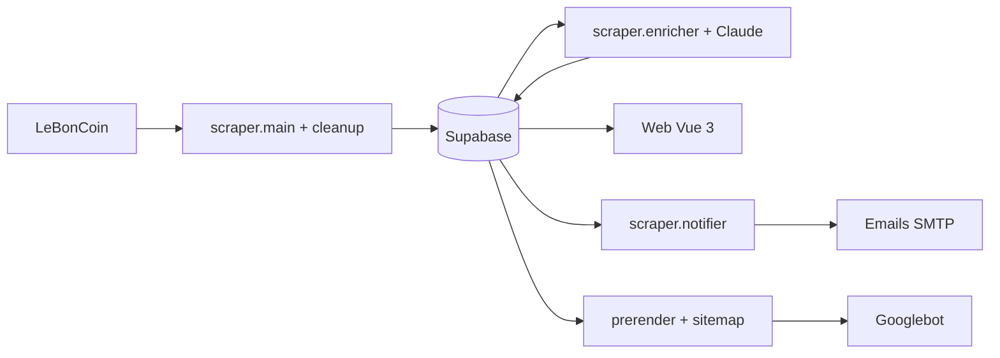
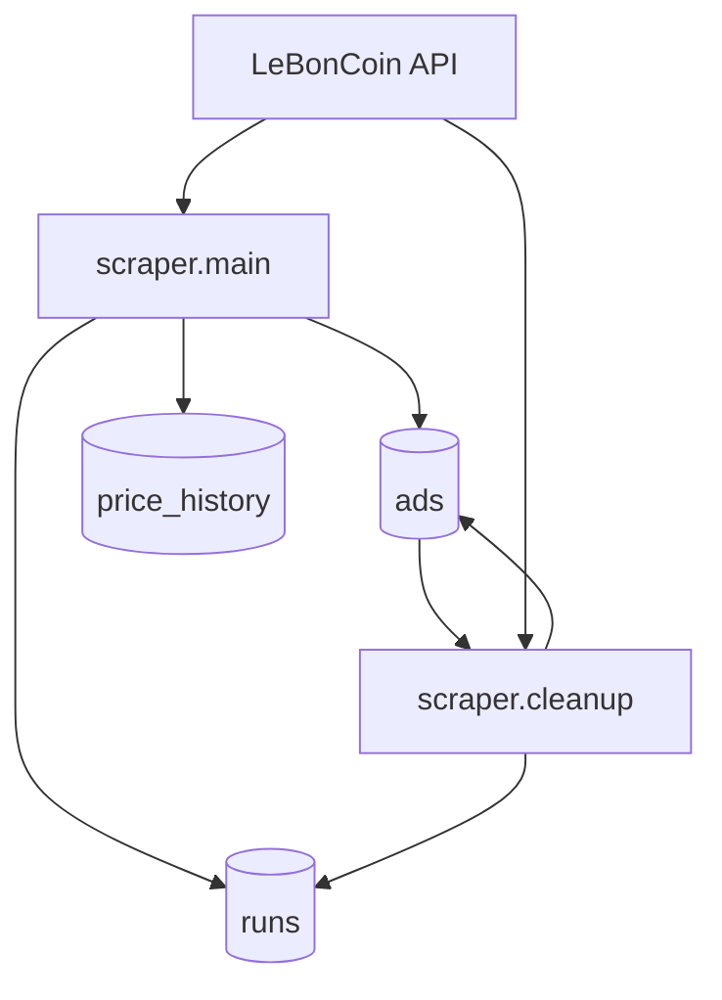
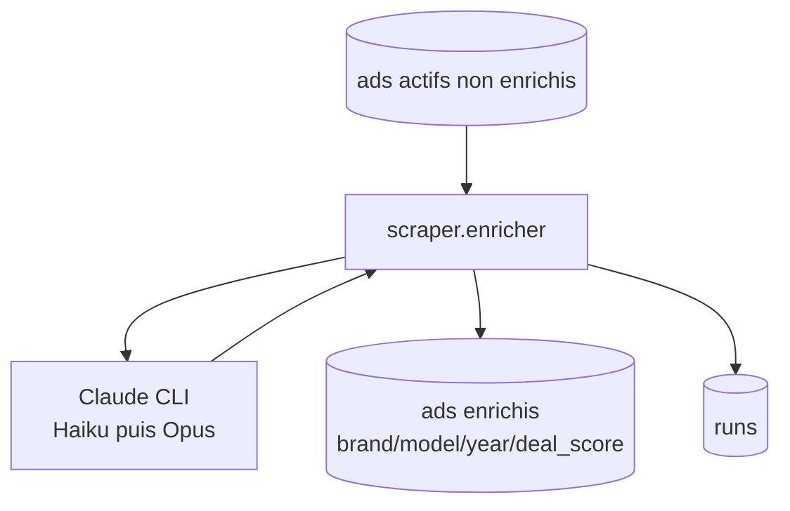
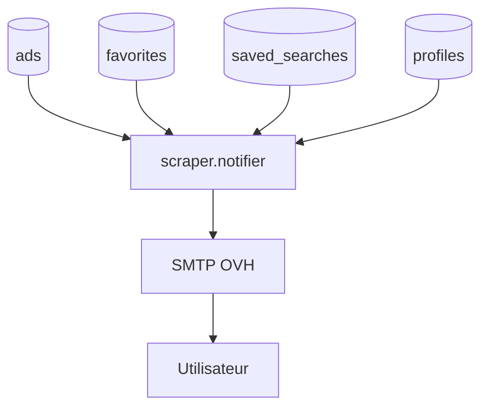
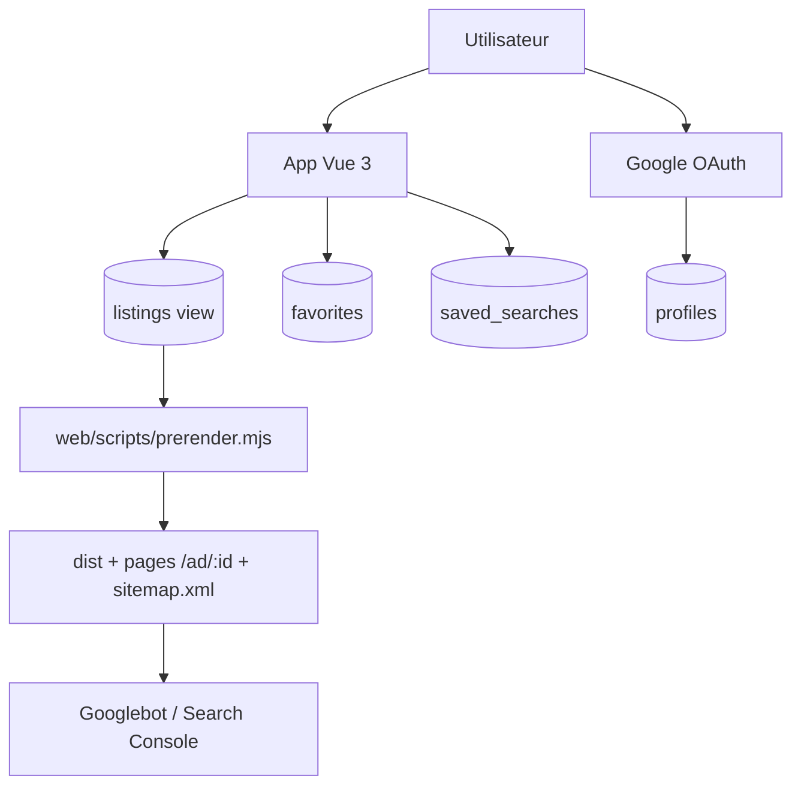

# lbc-sniper

Scrape Le Bon Coin, fait analyser chaque annonce par Claude (estimation de
prix de marché + score 0–100), et expose le tout dans une UI web.

## Architecture

### Vue d'ensemble (simplifiee)



### Bloc 1 - Ingestion et nettoyage



### Bloc 2 - Enrichissement IA



### Bloc 3 - Alertes utilisateurs



### Bloc 4 - Web, auth et SEO


- **scraper** (`scraper/main.py`) — fetch LBC via la lib [`lbc`](https://github.com/etienne-hd/lbc), upsert Supabase
- **enricher** (`scraper/enricher.py`) — prend chaque annonce non analysée, appelle `claude -p --model opus --json-schema ...`, stocke marque/modèle/année/prix marché/deal_score
- **web** (`web/`) — Vue 3 + Vite + Tailwind, requête directe Supabase via clé `anon`

## Setup

### 1. Supabase

Compte gratuit sur https://supabase.com, crée un projet en région EU. Récupère :
- `Project URL` (Settings → API)
- `anon` key (publique)
- `service_role` key (secrète)

### 2. Variables d'env

Copier les templates et remplir :

```bash
cp .env.example .env                 # racine — utilisée par le scraper (service_role)
cp web/.env.example web/.env         # web — utilisée par le frontend (anon)
```

### 3. Migration DB

```bash
supabase link --project-ref <ton-project-ref>
supabase db push
```

### 4. Dépendances

```bash
pip install -r requirements.txt
cd web && npm install
```

### 5. CLI Claude

```bash
claude
/login
/exit
```

(Une seule fois par machine, persiste ensuite.)

## Utilisation

```bash
# Pipeline complet : scrape + enrich
./run.bat

# Lancer le site
./start-web.bat        # http://localhost:5173
```

Ou manuellement :

```bash
python -m scraper.main                        # scrape uniquement
python -m scraper.enricher --limit 10         # enrich (max 10 annonces)
python -m scraper.enricher --model haiku      # mode rapide / moins fin
```

## Configuration des watches

`config.yaml` — un watch = une recherche LBC régulière :

```yaml
watches:
  - id: vtt-enduro-bayonne
    label: "VTT Enduro - 30km autour de Bayonne"
    category: VEHICULES_VELOS
    accept_category_ids: ["55"]      # filtre côté client (LBC élargit parfois)
    text: "enduro"
    location:
      city: Bayonne
      lat: 43.4933
      lng: -1.4747
      radius_km: 30
    price_max: 5000
    limit: 100
    enrichment_domain: "vtt_enduro"  # pilote le contexte expert du prompt Claude
```

## Hébergement (à venir)

- **Scraper** : tâche planifiée Windows toutes les 6h (IP résidentielle FR évite Datadome)
- **Web** : Vercel ou Netlify (statique, gratuit)
- **DB** : Supabase tier gratuit largement suffisant

## Stack

- Python 3.11+ (`lbc`, `supabase-py`)
- Claude CLI (`claude -p --json-schema`)
- Supabase (Postgres + RLS)
- Vue 3 + Vite + Tailwind + supabase-js


